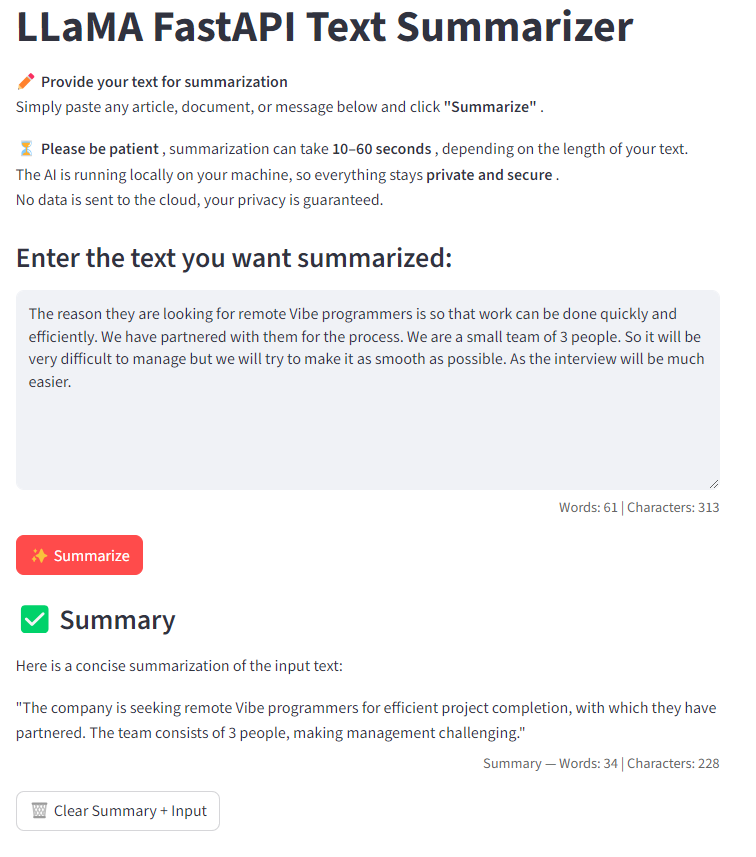
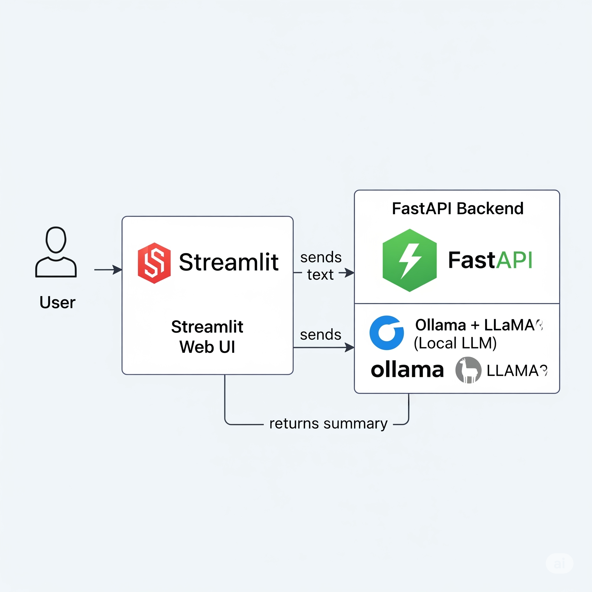

# 📝 LLaMA FastAPI Text Summarizer

A local AI-powered text summarizer that runs 100% on your machine.
No internet required. No data leaves your computer.

---
## 🖼️ Home Screenshot

> 💡

-----

### **Built With:**
- **FastAPI**: Backend API
- **Streamlit**: Frontend UI
- **Ollama + LLaMA3**: Local large language model (LLM)
- **Private & Secure**: Ideal for sensitive or confidential content

Perfect for summarizing articles, emails, reports, and more — all offline.

---

### **🚀 Quick Start (How to Run)**

#### **1. Prerequisites**

Before running, install:
- [Python 3.9+](https://www.python.org/downloads/)
- [Ollama](https://ollama.com/download) (for local LLM)
- [Git](https://git-scm.com/downloads) (optional, for package install)

> 💡 This app works on **Windows, macOS, and Linux**.

#### **2. Setup the Project**

```bash
# Clone the project (or download as ZIP)
git clone [https://github.com/sabelogumede/LLaMA-FastAPI-Summarizer.git](https://github.com/sabelogumede/LLaMA-FastAPI-Summarizer.git)
cd LLaMA-FastAPI-Summarizer

# Create a virtual environment
python -m venv venv

# Activate it
# On Windows:
venv\Scripts\activate
# On macOS/Linux:
source venv/bin/activate

# Install dependencies
pip install -r requirements.txt
````

#### **3. Download the LLM Model**

Run this in your terminal:

```bash
# Start Ollama in the background (opens a new window)
ollama serve

# In another terminal:
ollama pull llama3
```

> ✅ This downloads the LLaMA3 model (\~4.7GB). This step only needs to be done once.

#### **4. Run the App**

Open **two terminal windows**:

##### **Terminal 1: Start the FastAPI Backend**

```bash
uvicorn backend.main:app --host 0.0.0.0 --port 8000 --reload
```

##### **Terminal 2: Start the Streamlit Frontend**

```bash
streamlit run frontend/app.py
```

✅ Open the app at: [http://localhost:8501](https://www.google.com/search?q=http://localhost:8501)

-----

### **🧱 Architecture Overview**

The application's architecture is a simple, effective pipeline:

> 

- **User**: Interacts with the Streamlit UI

  - **Frontend**: `frontend/app.py` – Streamlit interface
  - **Backend**: `backend/main.py` – FastAPI server
  - **Model**: Runs locally via Ollama (`llama3`)
  - **Communication**: JSON over HTTP (localhost only)

🔐 **No data ever leaves your machine, ensuring complete privacy.**

-----

## API EndPonits

  * **Get**: **/health** A simple health check to verify the application is running.
  * **Post**: **/summarize** summarize the given text input.

-----

### **🛠️ Features**

  - ✅ Live word & character count on input
  - ✅ Clear input after summarization
  - ✅ Input validation (blocks short inputs)
  - ✅ Error handling (network, timeout, empty responses)
  - ✅ Responsive and user-friendly UI

-----

### **⚙️ Requirements**

See `requirements.txt`. Key packages include:

  - `fastapi` + `uvicorn`: API backend
  - `streamlit`: Frontend
  - `requests`: For calling Ollama
  - `pydantic`: Data validation
  - `streamlit-copy-button`: For copy functionality (installed from GitHub)

> 💡 The `streamlit-copy-button` package is not on PyPI. It's installed directly from GitHub with the following command:
>
> ```bash
> pip install git+[https://github.com/jandot/streamlit-copy-button.git](https://github.com/jandot/streamlit-copy-button.git)
> ```

-----

### **📂 Project Structure**

```
LLaMA-FastAPI-Summarizer/
│
├── .gitignore               # Ignores venv, cache, IDE files
├── README.md                # This file
├── requirements.txt         # Python dependencies
│
├── backend/
│   └── main.py              # FastAPI summarization endpoint
│
├── frontend/
│   └── app.py               # Streamlit UI with live counts & copy
│
└── venv/                    # (Ignored) Python virtual environment
```

-----

### **📌 Tips**

  - 🐢 **Summarization takes 10–60 seconds** — please be patient\!
  - 📏 Short inputs (\<5 words) are rejected to prevent the AI from "explaining" instead of summarizing.
  - 🔄 Use the **"🗑️ Clear Input"** button to start over.
  - 📋 Click **"📋 Copy summary"** to copy results to your clipboard.

-----

### **📦 Future Ideas**

  - Export summary as `.txt`
  - Support PDF/TXT file uploads
  - Add a model selector (e.g., `llama3`, `mistral`)
  - Add summary length options (short/medium/long)
  - Dockerize for easy deployment

-----

### **🙌 Made with ❤️**

By Sabelo Gumede – for local, private, and powerful AI.

Keep building\! 🚀

```
```